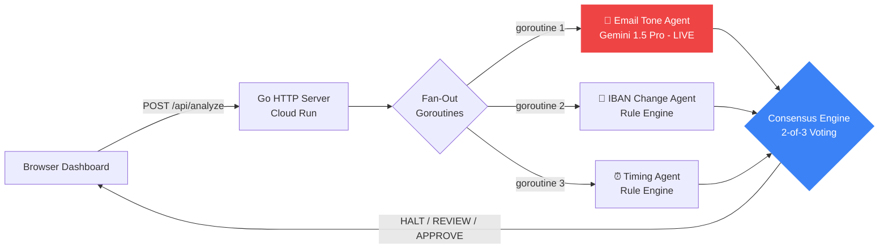

<div align="center">

# 🛡️ SentinelAegis

**AI-powered BEC fraud detection that stops wire fraud before the money moves.**

[](https://go.dev)
[](https://ai.google.dev)
[](https://cloud.google.com/run)
[](https://antigravity.dev)
[](LICENSE)

*Three agents. One consensus. Zero fraud.*

[Live Demo](https://sentinelaegis-XXXXX.run.app) · [Demo Video](#) · [Pitch Deck](#)

</div>

---

## What It Does

SentinelAegis is a SaaS-style dashboard that analyzes wire transfer requests for Business Email Compromise (BEC) fraud using a **3-agent AI consensus engine**. When a payment request arrives, three independent agents — email tone analysis (powered by Gemini 1.5 Pro), IBAN change detection, and timing anomaly detection — evaluate the transaction in parallel. A consensus engine applies 2-of-3 voting to produce a single decision: **APPROVE**, **REVIEW**, or **HALT**.

It's designed for bank compliance officers who need to make wire transfer decisions in seconds, not hours.

---

## Architecture



**Key decisions:**
- **Go stdlib only** — zero external dependencies, 15MB Docker image
- **Cloud Run** with `min-instances=1` — no cold starts during demo
- **Goroutine fan-out** — all 3 agents fire concurrently via `sync.WaitGroup`
- **Gemini via REST** — raw `net/http` calls, no SDK dependency

---

## What's Real vs. Simulated

We believe transparency builds credibility.

| Component | Status | Details |
|---|---|---|
| 📧 Email Tone Agent | ✅ **Live AI** | Real-time Gemini 1.5 Pro API call with structured JSON output |
| 🏦 IBAN Change Agent | 🔧 **Simulated** | Rule-based logic with embedded mock IBAN history |
| ⏰ Timing Agent | 🔧 **Simulated** | Rule-based logic with mock vendor payment windows |
| Consensus Engine | ✅ **Real** | 2-of-3 voting with weighted risk scoring |
| Cloud Run Deployment | ✅ **Real** | Live public URL, min-instances=1 |
| Dashboard UI | ✅ **Real** | Vanilla HTML/CSS/JS, no frameworks |

**In production**, the IBAN and Timing agents would connect to core banking APIs (SWIFT gpi, PSD2/PSD3 interfaces). The consensus engine architecture is designed so any signal source — real or simulated — plugs in identically.

---

## Demo Scenarios

| # | Scenario | Amount | Expected Result |
|---|---|---|---|
| 1 | CloudVault Hosting — routine monthly invoice | $32,400 | ✅ APPROVE |
| 2 | Partner Logistics — IBAN changed 5 days ago | $124,000 | ⚡ REVIEW |
| 3 | Greenfield Solutions — CEO impersonation BEC | $847,000 | 🚨 **HALT** |
| 4 | ADP Payroll — standard bi-weekly payroll | $87,500 | ✅ APPROVE |
| 5 | Meridian Holdings — fake escrow wire BEC | $1,250,000 | 🚨 **HALT** |

---

## Local Setup

```bash
# Clone
git clone https://github.com/YOUR_USERNAME/sentinelaegis.git
cd sentinelaegis

# Set your Gemini API key
export GEMINI_API_KEY=your_key_here

# Run
go run .

# Open
open http://localhost:8080
```

No `npm install`. No `pip install`. No `docker build`. Just `go run .`

---

## Cloud Run Deployment

```bash
# Build and push container image
gcloud builds submit --tag gcr.io/PROJECT_ID/sentinelaegis

# Deploy
gcloud run deploy sentinelaegis \
  --image gcr.io/PROJECT_ID/sentinelaegis \
  --platform managed \
  --region us-central1 \
  --allow-unauthenticated \
  --min-instances 1 \
  --max-instances 3 \
  --memory 256Mi \
  --set-env-vars GEMINI_API_KEY=your_key_here,MODEL_NAME=gemini-1.5-pro

# Verify
curl https://sentinelaegis-XXXXX.run.app/health
# → {"status":"ok","model":"gemini-1.5-pro"}
```

---

## Project Structure

```
sentinelaegis/
├── main.go                 ← HTTP server, CORS, routes
├── go.mod                  ← Zero external dependencies
├── Dockerfile              ← Multi-stage build, 15MB image
├── agents/
│   ├── consensus.go        ← 2-of-3 voting + shared types
│   ├── email_tone.go       ← Live Gemini 1.5 Pro call
│   ├── iban_change.go      ← Rule-based IBAN analysis
│   └── timing.go           ← Rule-based timing analysis
├── data/
│   └── transactions.go     ← 5 demo transactions
└── frontend/
    └── index.html          ← Single-file dashboard (HTML+CSS+JS)
```

---

## Tech Stack

| Layer | Technology | Why |
|---|---|---|
| Language | Go 1.22 | Fast compile, tiny binary, goroutines for concurrency |
| AI | Gemini 1.5 Pro | Structured JSON output, strong language analysis |
| Hosting | Cloud Run | Serverless, auto-scaling, $0 at rest |
| Frontend | Vanilla JS | Zero build step, zero dependencies |
| IDE | Antigravity | AI-assisted development |

---

## Team

| Name | Role |
|---|---|
| TBD | Lead Developer |
| TBD | Support Developer |
| TBD | Frontend & Testing |
| TBD | Research & Pitch |

*Al-Zaytoonah University of Jordan — FinTech & Secure Banking Track*

---

## License

MIT License — see [LICENSE](LICENSE) for details.

---

<div align="center">

**Built for the 2026 FinTech Hackathon**

*Three agents. One consensus. Zero fraud.*

</div>
