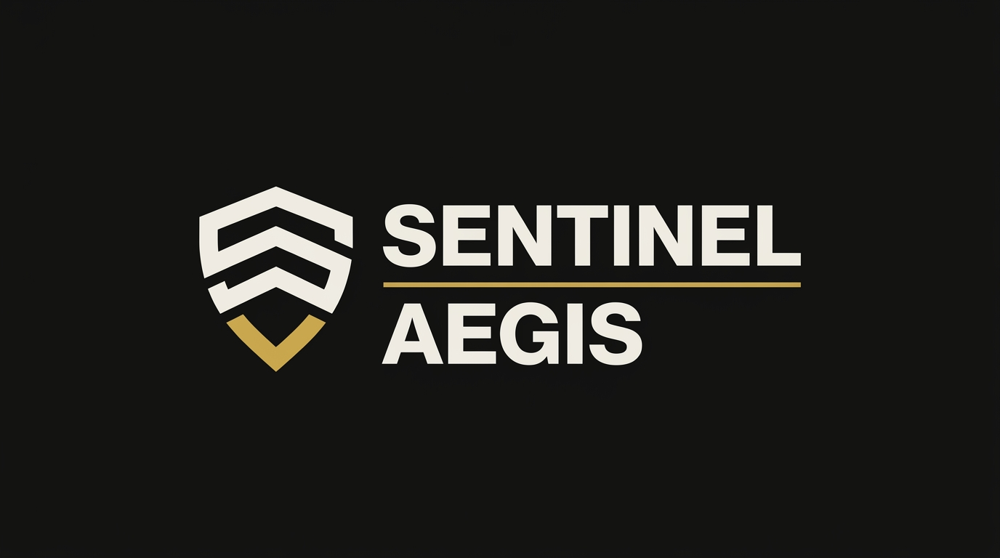
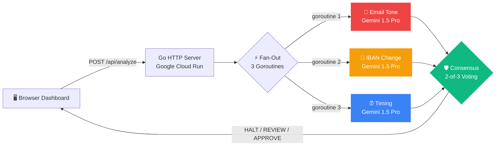

<!-- Cache refresh: 2026-04-24T21:00:00 -->
<div align="center">



**Multi-agent AI consensus engine that stops BEC wire fraud before the money moves.**

[](https://go.dev)
[](https://ai.google.dev)
[](https://cloud.google.com/run)
[](https://antigravity.dev)
[](agents/consensus_test.go)
[](LICENSE)

*Three AI agents. One consensus. Zero fraud.*

[🔗 Live Demo](https://sentinelaegis-471764064985.us-central1.run.app) · [🎬 Demo Video][VIDEO_URL] · [📊 Pitch Deck][DECK_URL]

</div>

---

## What It Does

SentinelAegis analyzes wire transfer requests using **3 independent Gemini 1.5 Pro agents** that evaluate email language, banking detail changes, and timing patterns simultaneously. A consensus engine applies 2-of-3 voting to produce one decision: **APPROVE**, **REVIEW**, or **HALT** — in under 4 seconds.

---

## Architecture



**Key design decisions:**
- **Go stdlib only** — zero external dependencies, 15MB Docker image
- **Cloud Run** with `min-instances=1` — no cold starts
- **3 concurrent Gemini calls** via goroutines + `sync.WaitGroup`
- **Rule-based fallbacks** — if Gemini is unavailable, deterministic rules take over silently

---

## What's Real vs. Simulated

Transparency builds trust. Here's exactly what happens under the hood:

| Component | Status | Details |
|---|---|---|
| 📧 Email Tone Agent | ✅ **Live Gemini AI** | Real-time Gemini 1.5 Pro call analyzing email language for BEC indicators |
| 🏦 IBAN Change Agent | ✅ **Live Gemini AI** + 🔧 Mock Data | Gemini analyzes IBAN change context; change history is mock data (production would connect to core banking) |
| ⏰ Timing Agent | ✅ **Live Gemini AI** + 🔧 Mock Data | Gemini analyzes timing patterns; vendor windows are mock data (production would use transaction history) |
| 🛡️ Consensus Engine | ✅ **Real Logic** | 2-of-3 weighted voting with risk score calculation |
| 📊 Metrics & Stats | ✅ **Real** | Atomic counters tracking analyses, halt rate, avg latency |
| ☁️ Cloud Run | ✅ **Real** | Live public URL, auto-scaling, min-instances=1 |

---

## Demo Scenarios

| # | Transaction | Amount | Expected | Why |
|---|---|---|---|---|
| 1 | CloudVault Hosting | $32,400 | ✅ APPROVE | Clean email, stable IBAN, business hours |
| 2 | ADP Payroll | $87,500 | ✅ APPROVE | Standard payroll confirmation, no anomalies |
| 3 | Partner Logistics | $124,000 | ⚡ REVIEW | IBAN changed 5 days ago, slight urgency |
| 4 | Greenfield Solutions | $847,000 | 🚨 **HALT** | CEO impersonation, IBAN changed 6hrs ago, after hours |
| 5 | Meridian Holdings | $1,250,000 | 🚨 **HALT** | Fake escrow, IBAN changed 3hrs ago, 11:14 PM |

---

## Local Setup

```bash
git clone https://github.com/Mutasem-mk4/sentinelAegis.git
cd sentinelAegis
export GEMINI_API_KEY=your_key_here
go run .
# Open http://localhost:8080
```

No `npm install`. No `pip install`. No `docker build`. Just `go run .`

Run tests:
```bash
go test ./agents/ -v
```

---

## Cloud Run Deployment

```bash
# Set your project
export PROJECT_ID=your-gcp-project
gcloud config set project $PROJECT_ID

# Enable APIs
gcloud services enable run.googleapis.com artifactregistry.googleapis.com cloudbuild.googleapis.com

# Build and deploy in one command
gcloud run deploy sentinelaegis \
  --source . \
  --region us-central1 \
  --allow-unauthenticated \
  --min-instances 1 \
  --max-instances 3 \
  --memory 256Mi \
  --set-env-vars GEMINI_API_KEY=$GEMINI_API_KEY,MODEL_NAME=gemini-1.5-pro

# Get the URL
gcloud run services describe sentinelaegis --region us-central1 --format='value(status.url)'
```

---

## API Reference

### `POST /api/analyze`
Runs all 3 AI agents concurrently and returns the consensus decision.

**Request:**
```json
{ "transaction_id": "TXN-004" }
```

**Response:**
```json
{
  "transaction_id": "TXN-004",
  "consensus": {
    "decision": "HALT",
    "risk_score": 92,
    "explanation": "TRANSACTION HALTED. 3 of 3 agents flagged HIGH risk...",
    "agent_breakdown": [
      { "agent_name": "email_tone", "risk_level": "HIGH", "confidence": 0.92, "flags": ["..."] },
      { "agent_name": "iban_change", "risk_level": "HIGH", "confidence": 0.91, "flags": ["..."] },
      { "agent_name": "timing", "risk_level": "HIGH", "confidence": 0.78, "flags": ["..."] }
    ]
  },
  "latency_ms": 2340
}
```

### `GET /api/stats`
Returns operational metrics.
```json
{
  "total_analyses": 12,
  "halt_count": 4,
  "review_count": 3,
  "approve_count": 5,
  "avg_latency_ms": 2100,
  "halt_rate_pct": 33.3,
  "agents_per_query": 3
}
```

### `GET /api/transactions`
Returns the 5 demo transaction scenarios.

### `GET /health`
Health check for Cloud Run.

---

## Scalability: How This Handles 1M+ Transactions

SentinelAegis is architected for horizontal scale:

| Challenge | Solution |
|---|---|
| **Throughput** | Cloud Run auto-scales to N instances. Each instance handles concurrent requests via goroutines. |
| **Gemini rate limits** | Rule-based fallbacks activate automatically — the system never crashes, just degrades gracefully. |
| **Latency** | All 3 agents fire in parallel (fan-out). Total latency = max(agent1, agent2, agent3), not sum. |
| **Cost** | ~$0.02 per analysis (3 Gemini calls). At 1M transactions/month: ~$20K — cheaper than one fraud loss. |
| **New agents** | The consensus engine accepts N agents. Add sanctions screening, geolocation, or network analysis without changing the core. |
| **Compliance** | PSD3 (EU 2026) mandates Verification of Payee. SentinelAegis provides the AI layer for automated compliance. |

---

## Project Structure

```
sentinelAegis/
├── main.go                 ← HTTP server, CORS, routing, metrics
├── go.mod                  ← Zero external dependencies
├── Dockerfile              ← Multi-stage build, 15MB image
├── agents/
│   ├── gemini.go           ← Shared Gemini REST client
│   ├── consensus.go        ← 2-of-3 voting engine + types
│   ├── consensus_test.go   ← 8 table-driven tests
│   ├── email_tone.go       ← Email language analysis (Gemini)
│   ├── iban_change.go      ← IBAN change detection (Gemini + rules)
│   └── timing.go           ← Timing anomaly detection (Gemini + rules)
├── data/
│   └── transactions.go     ← 5 demo scenarios
└── frontend/
    └── index.html          ← Dashboard (HTML + CSS + JS, single file)
```

---

## Team

| Name | Role |
|---|---|
| Mutasem Kharma | Lead Developer — Architecture, Backend, AI Integration |
| Moayad Darwish | Research & Strategy |
| Ibrahim Sabbah | Security & Risk Analysis |
| Fathe Al-allak | Frontend Development |

*Al-Zaytoonah University of Jordan · FinTech & Secure Banking Track · Build with AI 2026*

---

## License

MIT License — see [LICENSE](LICENSE) for details.

---

<div align="center">

**Built with [Antigravity IDE](https://antigravity.dev) · Powered by [Google Gemini](https://ai.google.dev) · Deployed on [Cloud Run](https://cloud.google.com/run)**

*Every hour, banks approve $14M in fraudulent wire transfers. We built the system that stops them.*

</div>
