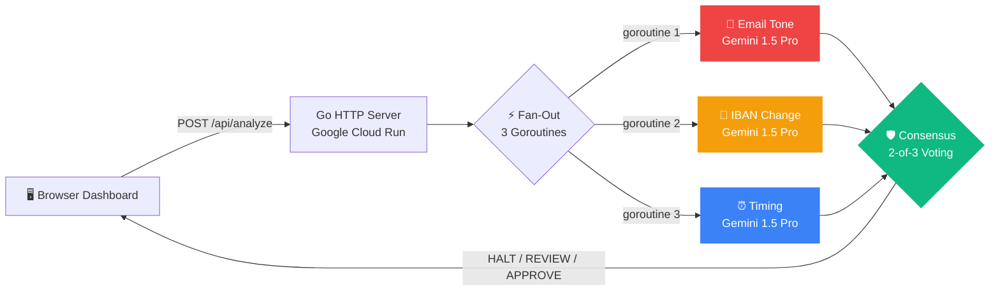

<!-- Cache refresh: 2026-05-01T16:00:00 -->
<div align="center">


# SentinelAegis
## Autonomous Multi-Agent Consensus for Cross-Domain Financial Integrity

[](https://go.dev)
[](https://ai.google.dev)
[](https://cloud.google.com/run)
[](https://antigravity.dev)
[](LICENSE)
[](agents/consensus_test.go)
[](api/openapi/sentinel-aegis.yaml)

*Three AI agents. One consensus. Zero fraud.*

[🔗 Live Demo](https://sentinelaegis-471764064985.us-central1.run.app) · [📊 API Spec](api/openapi/sentinel-aegis.yaml) · [📄 PSD3 Compliance](docs/psd3-compliance-mapping.md)

</div>

---

## 🛡️ The Problem

Business Email Compromise (BEC) fraud costs the global financial system **$2.7 billion annually** (FBI IC3, 2025). Modern attacks are multi-stage — an attacker compromises a vendor's email, manipulates banking details in the ERP system, and executes a wire transfer during off-hours to avoid oversight. **No existing system correlates behavioral anomalies across email, banking, and timing domains simultaneously.** This visibility gap will be legislated against under PSD3/PSR in 2026.

## 🧠 Our Solution

**SentinelAegis** deploys **three independent AI agents** powered by Google Gemini 1.5 Pro that analyze every wire transfer request from different perspectives. A deterministic **2-of-3 consensus engine** produces a single decision: **HALT**, **REVIEW**, or **APPROVE** — in under 4 seconds.

## 🏗️ Architecture



**Key design decisions:**
- **Go stdlib only** — zero external framework dependencies, 15MB Docker image
- **Cloud Run** with `min-instances=1` — no cold starts
- **3 concurrent Gemini calls** via goroutines + `sync.WaitGroup`
- **Rule-based fallbacks** — if Gemini is unavailable, deterministic rules take over silently
- **Structured JSON logging** via `slog` with correlation IDs for full audit trails
- **Graceful shutdown** via `signal.NotifyContext` for zero-downtime deployments

---

## 🚀 Quick Start

```bash
# 1. Clone
git clone https://github.com/Mutasem-mk4/sentinelAegis.git
cd sentinelAegis

# 2. Set your Gemini API key
export GEMINI_API_KEY=your_key_here

# 3. Run
go run .

# 4. Open http://localhost:8080

# 5. Run tests
make test
```

No `npm install`. No `pip install`. No `docker build`. Just `go run .`

---

## 🔬 How It Works

### The Three Agents

| Agent | Signal Domain | Detection Target | Gemini Role |
|---|---|---|---|
| 📧 **Email Tone** | Natural language | Social engineering, urgency pressure, authority exploitation, isolation tactics | Full prompt analysis with BEC-specific system instructions |
| 🏦 **IBAN Change** | Banking data | Beneficiary manipulation, IBAN-swap attacks within 48h window, cross-border changes | AI analysis of change context + deterministic rules |
| ⏰ **Timing** | Behavioral patterns | Off-hours requests, deadline pressure, deviations from vendor payment windows | AI analysis of behavioral patterns + deterministic rules |

### The Consensus Protocol

```
risk_score = (HIGH_count × 40) + (MEDIUM_count × 20) + avg(confidence) × 10
```

| Condition | Decision | Score Range | Action |
|---|---|---|---|
| 2+ agents flag HIGH | **🚨 HALT** | 85–100 | Transaction blocked, manual review required |
| 1 agent flags HIGH | **⚡ REVIEW** | 45–75 | Escalated to human analyst |
| 0 agents flag HIGH | **✅ APPROVE** | 0–30 | Standard processing proceeds |

### Resilience: Rule-Based Fallbacks

Every agent implements dual-mode analysis. If Gemini is unavailable:
- **Email Agent** → Returns LOW risk (manual review flag)
- **IBAN Agent** → Deterministic rules: ≤48h=HIGH, ≤168h=MEDIUM, >168h=LOW
- **Timing Agent** → Deterministic rules: >120min=HIGH, >30min=MEDIUM, in-window=LOW

**The system never crashes. It only degrades gracefully.**

---

## What's Real vs. Simulated

| Component | Status | Details |
|---|---|---|
| 📧 Email Tone Agent | ✅ **Live Gemini AI** | Real-time Gemini 1.5 Pro call analyzing email language for BEC indicators |
| 🏦 IBAN Change Agent | ✅ **Live Gemini AI** + 🔧 Mock Data | Gemini analyzes IBAN change context; change history is mock data |
| ⏰ Timing Agent | ✅ **Live Gemini AI** + 🔧 Mock Data | Gemini analyzes timing patterns; vendor windows are mock data |
| 🛡️ Consensus Engine | ✅ **Real Logic** | 2-of-3 weighted voting with risk score calculation |
| 📊 Metrics & Stats | ✅ **Real** | Atomic counters tracking analyses, halt rate, avg latency |
| ☁️ Cloud Run | ✅ **Real** | Live public URL, auto-scaling, min-instances=1 |
| 📧 Gmail Ingestion | ✅ **Real** | OAuth2 + Pub/Sub push notifications for autonomous monitoring |
| 📡 SSE Dashboard | ✅ **Real** | Real-time event streaming to connected browsers |

---

## 🧪 Demo Scenarios

| # | Transaction | Amount | Expected | Why |
|---|---|---|---|---|
| 1 | CloudVault Hosting | $32,400 | ✅ APPROVE | Clean email, stable IBAN, business hours |
| 2 | ADP Payroll | $87,500 | ✅ APPROVE | Standard payroll confirmation, no anomalies |
| 3 | Partner Logistics | $124,000 | ⚡ REVIEW | IBAN changed 5 days ago, slight urgency |
| 4 | Greenfield Solutions | $847,000 | 🚨 **HALT** | CEO impersonation, IBAN changed 6hrs ago, after hours |
| 5 | Meridian Holdings | $1,250,000 | 🚨 **HALT** | Fake escrow, IBAN changed 3hrs ago, 11:14 PM |

---

## 📊 Performance

| Metric | Value |
|---|---|
| **Average Analysis Latency** | <4 seconds (3 parallel Gemini calls) |
| **Consensus Computation** | <1μs (see benchmarks) |
| **Docker Image Size** | ~15MB |
| **Memory Usage** | <256MB |
| **Test Coverage** | 16 tests, 2 benchmarks |
| **Cold Start** | 0 (min-instances=1) |
| **Cost Per Analysis** | ~$0.02 (3 Gemini API calls) |

---

## 📜 PSD3/PSR Compliance

SentinelAegis is designed with the upcoming EU PSD3/PSR regulation in mind:

| PSD3 Requirement | SentinelAegis Feature |
|---|---|
| Verification of Payee (Art. 58) | IBAN Change Agent validates beneficiary details |
| Strong Customer Authentication (Art. 97) | Multi-agent consensus mimics multi-factor verification |
| Real-Time Fraud Monitoring (Art. 83) | Sub-5-second analysis with SSE dashboard |
| Audit Trail (Art. 85) | Structured JSON logging with correlation IDs |
| Incident Response (Art. 96) | Automated HALT with full reasoning chain |

📄 [Full PSD3 Compliance Mapping →](docs/psd3-compliance-mapping.md)

---

## 🔐 Security

- **Zero secrets in code** — all credentials via environment variables
- **Rate limiting** — 30 requests/minute per IP with token bucket algorithm
- **Input validation** — all API inputs validated and sanitized
- **Non-root container** — Docker runs as dedicated `aegis` user
- **Structured audit logging** — every decision logged with correlation ID
- **CORS configured** — restricts cross-origin access
- **Server timeouts** — read (15s), write (60s), idle (120s)

---

## Scalability: How This Handles 1M+ Transactions

| Challenge | Solution |
|---|---|
| **Throughput** | Cloud Run auto-scales to N instances. Each handles concurrent requests via goroutines. |
| **Gemini rate limits** | Rule-based fallbacks activate automatically — system never crashes. |
| **Latency** | All 3 agents fire in parallel (fan-out). Total latency = max(agent), not sum. |
| **Cost** | ~$0.02 per analysis. At 1M transactions/month: ~$20K — cheaper than one fraud loss. |
| **New agents** | Consensus engine accepts N agents. Add sanctions, geolocation, or network analysis without changing core. |
| **Compliance** | PSD3 mandates VoP. SentinelAegis provides the AI layer for automated compliance. |

---

## 📂 Project Structure

```
sentinelAegis/
├── main.go                    ← HTTP server, middleware, routing, graceful shutdown
├── go.mod                     ← Dependencies (minimal)
├── Dockerfile                 ← Multi-stage build, non-root, ~15MB image
├── Makefile                   ← Build, test, lint, deploy automation
├── agents/
│   ├── gemini.go              ← Shared Gemini REST client
│   ├── consensus.go           ← 2-of-3 voting engine + types
│   ├── consensus_test.go      ← 8 table-driven consensus tests
│   ├── agents_test.go         ← 7 agent-level tests
│   ├── benchmark_test.go      ← Performance benchmarks
│   ├── email_tone.go          ← Email language analysis (Gemini)
│   ├── iban_change.go         ← IBAN change detection (Gemini + rules)
│   ├── timing.go              ← Timing anomaly detection (Gemini + rules)
│   └── custom.go              ← Custom transaction injection
├── data/
│   └── transactions.go        ← 5 demo scenarios
├── gmail/
│   ├── client.go              ← Gmail API integration (OAuth2)
│   ├── analyzer.go            ← Email → Transaction → Analysis pipeline
│   └── pubsub.go              ← Pub/Sub push notification handler
├── sse/
│   └── hub.go                 ← Server-Sent Events broadcasting
├── types/
│   └── types.go               ← Shared type definitions
├── frontend/
│   └── index.html             ← SOC Dashboard (HTML + CSS + JS)
├── api/
│   └── openapi/
│       └── sentinel-aegis.yaml ← OpenAPI 3.1 specification
├── scripts/
│   └── deploy.sh              ← Cloud Run deployment automation
└── docs/
    ├── adr/
    │   ├── 001-multi-agent-consensus.md
    │   ├── 002-rule-based-fallbacks.md
    │   └── 003-stdlib-only.md
    ├── psd3-compliance-mapping.md
    ├── pitch-deck-outline.md
    └── GMAIL_SETUP.md
```

---

## ☁️ Cloud Run Deployment

```bash
# Set your project
export PROJECT_ID=your-gcp-project
gcloud config set project $PROJECT_ID

# Enable APIs
gcloud services enable run.googleapis.com artifactregistry.googleapis.com cloudbuild.googleapis.com

# Build and deploy in one command
gcloud run deploy sentinelaegis \
  --source . \
  --region us-central1 \
  --allow-unauthenticated \
  --min-instances 1 \
  --max-instances 3 \
  --memory 256Mi \
  --set-env-vars GEMINI_API_KEY=$GEMINI_API_KEY,MODEL_NAME=gemini-1.5-pro

# Or use the deploy script
./scripts/deploy.sh
```

---

## API Reference

### `POST /api/analyze` — Analyze a demo transaction
```json
// Request
{ "transaction_id": "TXN-004" }

// Response
{
  "transaction_id": "TXN-004",
  "consensus": {
    "decision": "HALT",
    "risk_score": 92,
    "explanation": "TRANSACTION HALTED. 3 of 3 agents flagged HIGH risk...",
    "agent_breakdown": [
      { "agent_name": "email_tone", "risk_level": "HIGH", "confidence": 0.92, "flags": ["..."] },
      { "agent_name": "iban_change", "risk_level": "HIGH", "confidence": 0.91, "flags": ["..."] },
      { "agent_name": "timing", "risk_level": "HIGH", "confidence": 0.78, "flags": ["..."] }
    ]
  },
  "latency_ms": 2340,
  "correlation_id": "sa-1714500000000"
}
```

### `POST /api/analyze/custom` — Ad-hoc analysis with custom data
### `GET /api/stats` — Operational metrics
### `GET /api/stream` — Real-time SSE event stream
### `GET /healthz` — Health check
### `GET /readyz` — Readiness check

📄 [Full API Specification (OpenAPI 3.1) →](api/openapi/sentinel-aegis.yaml)

---

## 🛠️ Built With

| Technology | Purpose |
|---|---|
| **Google Gemini 1.5 Pro** | AI analysis backbone for all 3 agents |
| **Google Cloud Run** | Serverless deployment with auto-scaling |
| **Gmail API + Pub/Sub** | Real-time email ingestion for autonomous monitoring |
| **Go 1.22** | Zero-framework backend (stdlib only) |
| **Antigravity IDE** | Development, testing, and deployment environment |
| **Server-Sent Events** | Real-time dashboard updates |

---

## 👥 Team

| Name | Role |
|---|---|
| Mutasem Kharma | Lead Developer — Architecture, Backend, AI Integration |
| Moayad Darwish | Research & Strategy |
| Ibrahim Sabbah | Security & Risk Analysis |
| Fathe Al-allak | Frontend Development |

*Al-Zaytoonah University of Jordan · FinTech & Secure Banking Track · Build with AI 2026*

---

## 📄 License

MIT License — see [LICENSE](LICENSE) for details.

---

<div align="center">

**Built with [Antigravity IDE](https://antigravity.dev) · Powered by [Google Gemini](https://ai.google.dev) · Deployed on [Cloud Run](https://cloud.google.com/run)**

*Every hour, banks approve $14M in fraudulent wire transfers. We built the system that stops them.*

</div>
