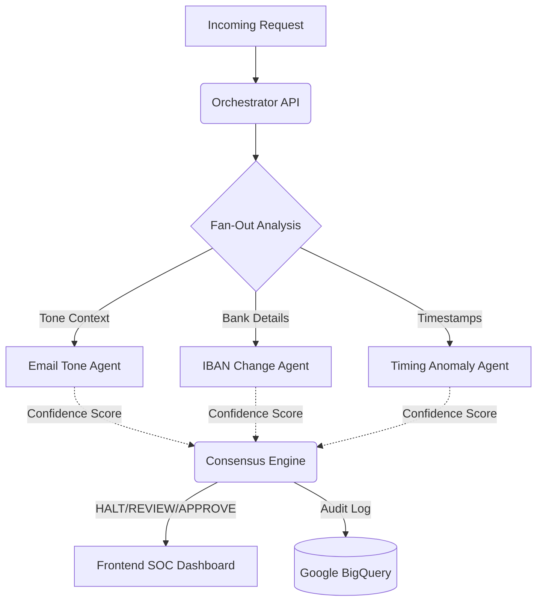

# SentinelAegis 🛡️


**SentinelAegis** is an autonomous Security Operations Center (SOC) platform designed to detect and block Business Email Compromise (BEC) and Invoice Fraud in real-time.

## 🚨 The $2.9 Billion Problem
In 2024, BEC attacks accounted for billions of dollars in losses globally. Attackers exploit human trust, hijacking email threads and swapping payment details at the last minute. Traditional rule-based security systems fail because they cannot understand context, tone, or timing anomalies. 

## 🧠 The Solution: Context-Aware Multi-Agent AI
SentinelAegis utilizes a fan-out multi-agent architecture powered by **Google Gemini 2.5 Flash**. Instead of a single AI prompt, each transaction is evaluated concurrently by specialized agents:
- **Email Tone Agent**: Detects urgency and secrecy.
- **IBAN Change Agent**: Correlates bank detail modifications.
- **Timing Anomaly Agent**: Detects off-hours requests.

A **Consensus Engine** aggregates their risk scores to autonomously APPROVE, REVIEW, or HALT the transaction.

## 🏗️ Architecture



## 📜 PSD3 Compliance Mapping
| PSD3 Requirement | SentinelAegis Implementation |
| :--- | :--- |
| **Explainable AI** | Every decision includes a natural-language breakdown from the agents. |
| **Immutable Auditing** | All consensus decisions are logged asynchronously to Google BigQuery. |
| **Resiliency** | Rule-based fallback triggers instantly if the AI API is rate-limited. |

## 🚀 Quick Start

### 1. Clone & Configure
```bash
git clone https://github.com/Mutasem-mk4/sentinelAegis.git
cd sentinelAegis-go
cp .env.example .env
# Edit .env with your Google Gemini API key and GCP details
```

### 2. Build & Run Locally
```bash
go mod download
go build -o sentinelaegis .
./sentinelaegis
```
Access the SOC Dashboard at `http://localhost:8080`

### 3. Deploy to Cloud Run
```bash
gcloud run deploy sentinelaegis \
  --source . \
  --region us-central1 \
  --allow-unauthenticated \
  --update-env-vars="GEMINI_API_KEY=your_key,MODEL_NAME=gemini-2.5-flash"
```

## 🎥 Demo Instructions
To test the platform:
1. Open the dashboard.
2. Click **"Run All 5 Demo Scenarios"** to simulate a live transaction stream.
3. Watch routine payments process while **TXN-004** triggers a massive red HALT alert.
4. Click the row to expand the natural-language explanation generated by Gemini.
5. Click **"Trigger Custom BEC Scenario"** to submit a handcrafted attack payload.

## 👥 Team
- **Mutasem Kharma** - Architect & Lead Engineer (Antigravity IDE Project Challenge)
