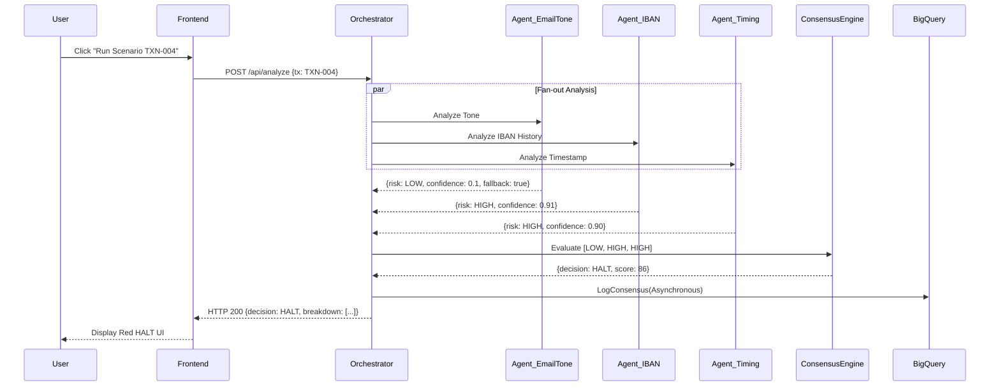

# Trace View: Multi-Agent Consensus

This document traces the path of a high-risk transaction (`TXN-004`) through the SentinelAegis platform.

## Narrative
When `TXN-004` is submitted, the Orchestrator fans out the request to three distinct AI agents running concurrently. Each agent evaluates a different vector of the transaction.
- The **Email Tone Agent** analyzes the text but falls back to rule-based low risk due to API timeout.
- The **IBAN Change Agent** detects a modification 6 hours prior and flags HIGH risk.
- The **Timing Anomaly Agent** notes the request is 1h47m outside standard hours and flags HIGH risk.
The Orchestrator aggregates these responses and the Consensus Engine determines a final `HALT` decision because 2 out of 3 agents flagged HIGH risk.

## Sequence Diagram

